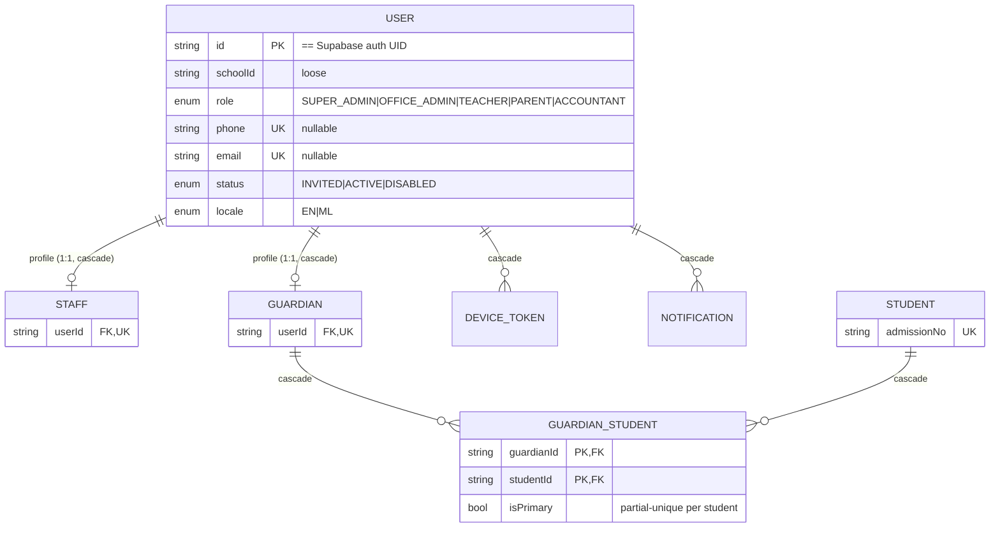
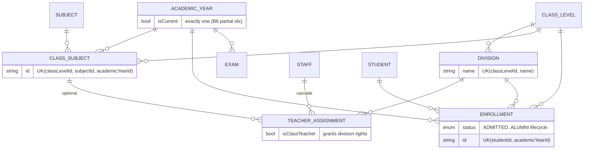
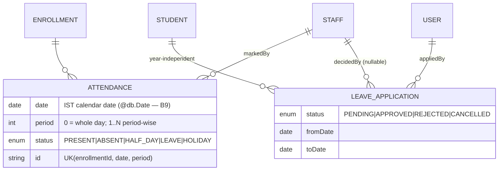
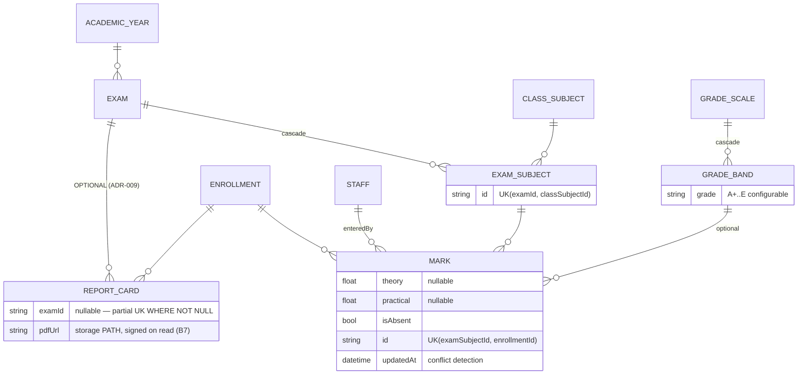
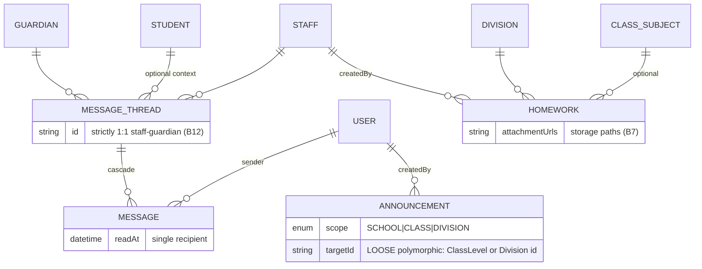
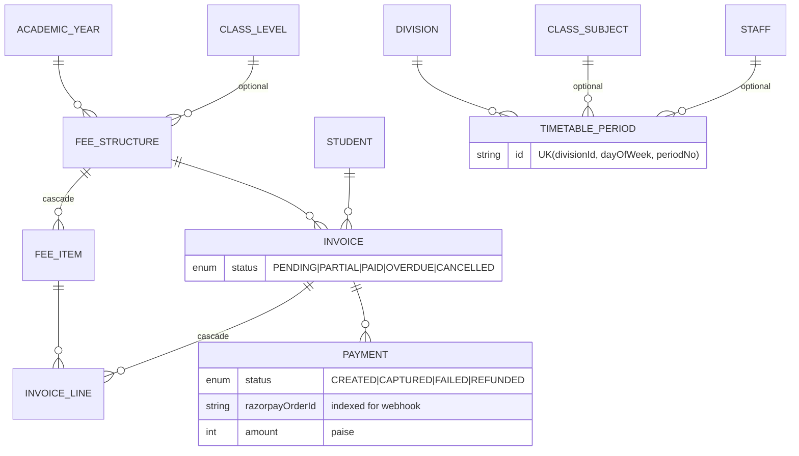

# Database Relationship Diagram — School Management Portal

Visual companion to Dev PRD §6 (the schema there is the source of truth). Mermaid ER diagram of the **full target schema** (all milestones + add-ons). Milestone tags show when each model's migration lands (numbering per REVIEW_FINDINGS A1 — code numbering: M1 auth, M2 people, …).

## Legend

- `||--o{` one-to-many · `||--||` one-to-one · `}o--o{` many-to-many (via join model)
- **Loose refs** (deliberately no FK): `schoolId` everywhere (ADR-008), `AuditLog`/`ImportJob` actor+entity (ADR-007), `Announcement.targetId` (polymorphic). Shown as dashed notes, not edges.
- Partial unique indexes (raw SQL in migrations): `ReportCard(enrollmentId, examId) WHERE examId IS NOT NULL` (ADR-009), `GuardianStudent(studentId) WHERE isPrimary`, and (proposed, REVIEW_FINDINGS B6) `AcademicYear(schoolId) WHERE isCurrent`.

## Identity & people (M1–M2)

## Academic structure & enrollment (M2)

## Attendance & leave (M3 attendance, M5 leave)

Leave→Attendance bridge (no FK): on APPROVED, service resolves `studentId → current ACTIVE Enrollment` and upserts `Attendance(LEAVE)` per school day (§8.7; school-day source = calendar model, REVIEW_FINDINGS B1).

## Exams, marks, report cards (M4)

## Communication & notifications (M5)

## Ops, flags, add-ons (M1 audit/flags; add-ons behind flags)

Standalone (loose refs only): `SCHOOL` (tenant root), `AUDIT_LOG(actorUserId, entityType, entityId, before/afterJson)`, `IMPORT_JOB`, `FEATURE_FLAG(UK schoolId+key)`.

**Proposed addition (B1):** `HOLIDAY(schoolId, date, name, scope?)` + working-weekday config in typed `SchoolSettings` — required by leave approval and the absence job.

## onDelete policy summary (DATABASE_CONVENTIONS §7)

| Cascade (composition) | Restrict (history/money) |
|---|---|
| Staff/Guardian→User, GuardianStudent, DeviceToken, Notification, GradeBand→Scale, ExamSubject→Exam, Message→Thread, FeeItem→Structure, InvoiceLine→Invoice | Mark, Attendance, Enrollment, Invoice, Payment, ReportCard, LeaveApplication, all academic structure |
